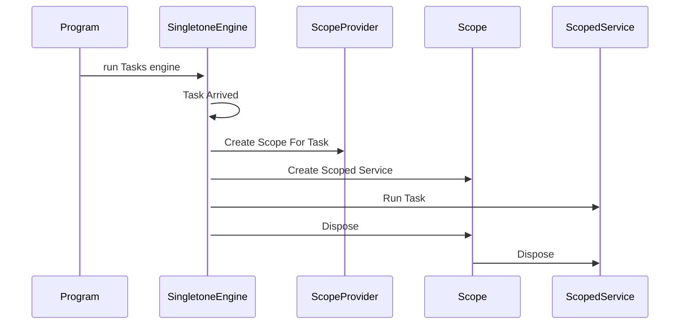

Simple Injector scoped Task
=======
dotnet 6 app that creates an engine of tasks, each task runs on its own scope, and dies as the task ends.

show case of:
- creating Task scope in TasksEngine.
- properly async dispose dependencies

